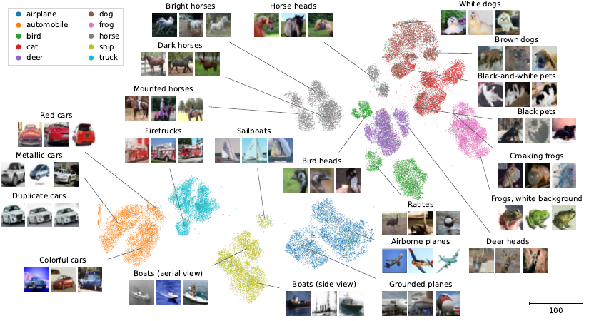
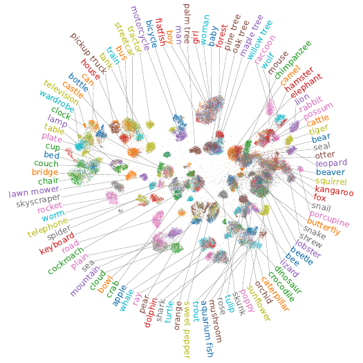
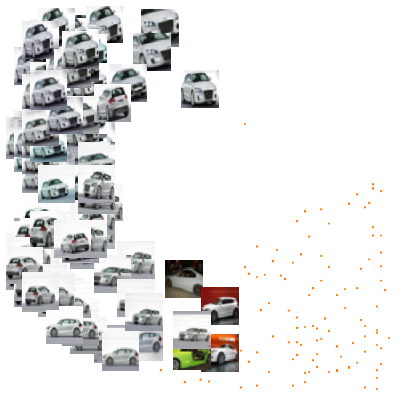
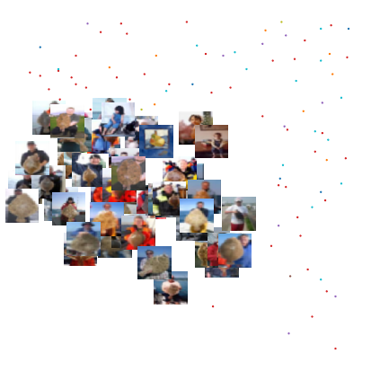

# Unsupervised visualization of image datasets using contrastive learning

This is the code for the paper “Unsupervised visualization of image datasets using contrastive learning.”

We show that it is possible to visualize datasets such as CIFAR-10 and CIFAR-100 with a contrastive learning technique, while preserving a lot of structure!

# Duplicates and oddities

We found out that there are >150 duplicates of just three separate images in CIFAR-10!  Apparently this has not been discovered or discussed anywhere else and we basically stumbled upon this by exploring the visualizations.

Furthermore there seems to be some quite strange images in CIFAR-10:

And finally, there is a whole class of flatfishes, that seem to be misplaces, but they actually consist of caught flatfishes along with fishermen.

# Implementation

The code lies in `cnexp/` and it should be possible to install everything with `pip install -e .` at least that is how I installed this package.

The figures are in `figures/` and have been created with the script files ending in `.do` in `media/`.  If you want to reproduce those figures you need to use `redo` and change some variables in `redo.py` so that it runs.  And you probably want an available GPU/GPU cluster.

